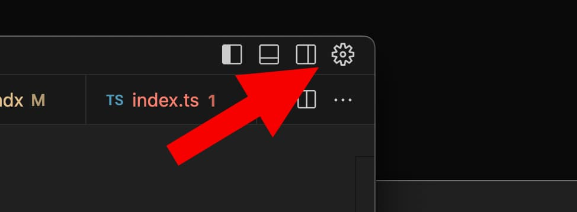
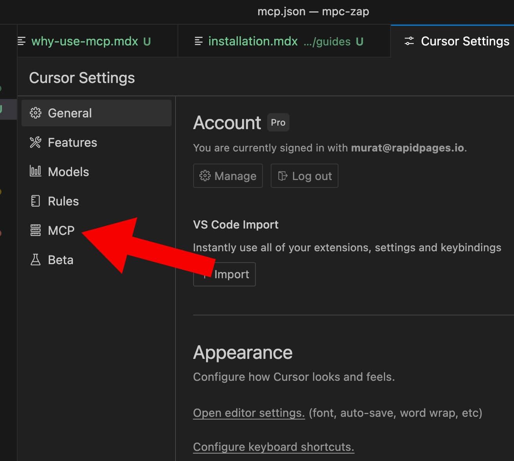
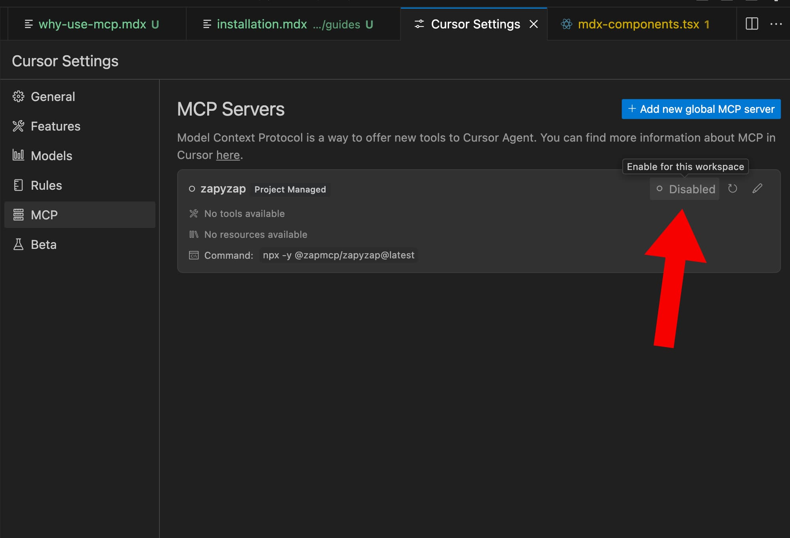

# Installation
Once you have packaged and published your ZapMCP package to NPM, you will be able to use it from any IDE that supports MCP. Below are some instructions to help you with the installation.

## Cursor

For local configuration, edit `.cursor/mcp.json` in your project root, or `~/.cursor/mcp.json` for global configuration. For the following example, we're using **zapyzap** as our library name, and **@zapmcp/zapyzap** as our NPM package name. Feel free to change these values accordingly.

MacOS/Linux
```
{
  "mcpServers": {
    "zapyzap": {
      "command": "npx",
      "args": ["-y", "@zapmcp/zapyzap@latest"]
    }
  }
}
```
Windows
```
{
  "mcpServers": {
    "zapyzap": {
      "command": "cmd",
      "args": ["/c", "npx", "-y", "@zapmcp/zapyzap@latest"]
    }
  }
}
```

## Windsurf

Edit `~/.codeium/windsurf/mcp_config.json` (only supports global configuration). For the following example, we're using **zapyzap** as our library name, and **@zapmcp/zapyzap** as our NPM package name. Feel free to change these values accordingly.

MacOS/Linux
```
{
  "mcpServers": {
    "zapyzap": {
      "command": "npx",
      "args": ["-y", "@zapmcp/zapyzap@latest"]
    }
  }
}
```
Windows
```
{
  "mcpServers": {
    "zapyzap": {
      "command": "cmd",
      "args": ["/c", "npx", "-y", "@zapmcp/zapyzap@latest"]
    }
  }
}
```

## After Installation Steps
### Cursor
1. Open Cursor settings



2. Navigate to MCP settings



3. Click “enable” on the `zapyzap` MCP server



If you have an agent chat open, you’ll need to re-open it or start a new chat to use the MCP server. It may take a minute for the MCP server to start the first time as it needs to download the package from npm.
